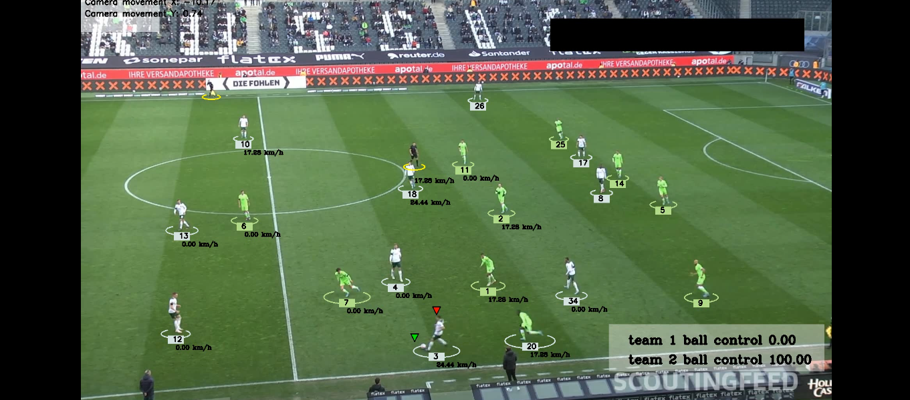
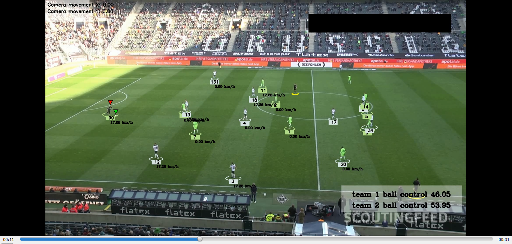

# Football Analysis with YOLOv5 and OpenCV

This project is a comprehensive football analysis tool that uses computer vision techniques such as object detection, tracking, and camera movement estimation to analyze football match videos. The project leverages state-of-the-art models like YOLOv5 for player and ball detection, OpenCV for video processing, and several custom algorithms to track players, assign teams, and estimate distances.

## Features

- **Player and Ball Detection**: Detects players and the ball using YOLOv5.
- **Player Tracking**: Tracks the movements of players and the ball throughout the match.
- **Team Assignment**: Automatically assigns players to teams based on color detection and tracking data.
- **Ball Possession Assignment**: Identifies which player is in possession of the ball during the match.
- **Camera Movement Estimation**: Detects and estimates the movement of the camera throughout the video.
- **Speed and Distance Estimation**: Calculates the speed and distance covered by players during the match.
- **Annotated Output Video**: Generates a video with overlaid annotations including team assignments, ball possession, and player trajectories.

## Project Structure

```bash
├── models/                      # Directory containing YOLOv5 trained models
├── stubs/                        # Directory for saving intermediate stub files
├── utils.py                      # Utility functions for video reading, saving, etc.
├── trackers.py                   # YOLOv5 tracker logic
├── team_assigner.py              # Logic for assigning teams based on player detection
├── assign_ball_player.py         # Logic for assigning ball possession to players
├── camera_movement.py            # Camera movement estimation logic
├── view_transforms.py            # View transformations for positional adjustments
├── speedDistanceEstimator.py     # Speed and distance estimation logic
├── your_script.py                # Main script file
└── README.md                     # Project documentation
``` 
## Results




## Prerequisites 

To run this project, you will need the following:

- **Python 3.8 or higher**
- **OpenCV**
- **PyTorch**
- **NumPy**
- **Pandas**


## Usage
To process a football match video and generate an annotated output video, run the following command:

``` bash
git clone https://github.com/aymen-000/Football_Analysis
pip install -r requirements.txt
cd Football_Analysis
python main.py "<input_video_path>" "<output_video_path>"
```
